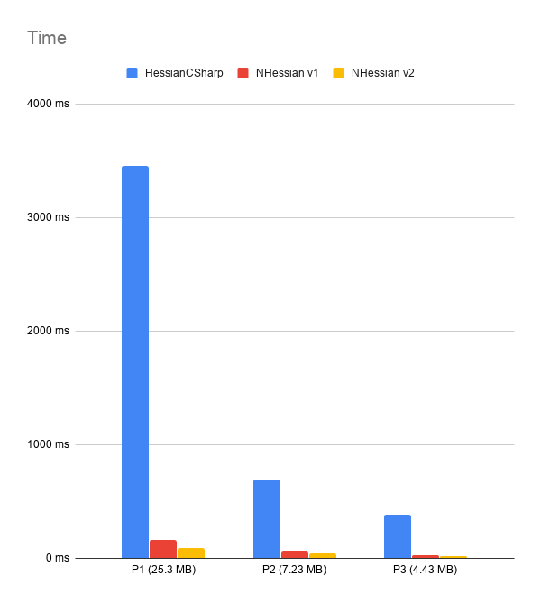
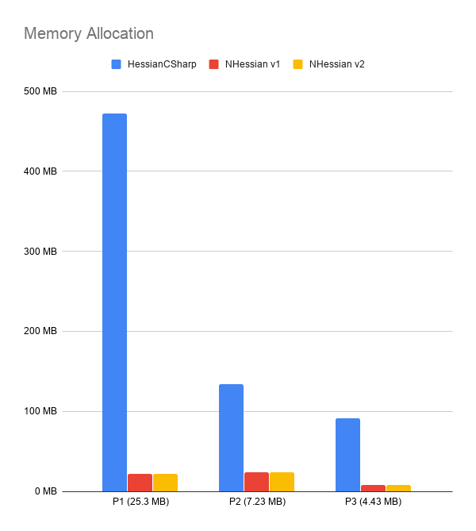

# NHessian

[](https://github.com/k4tan/NHessian/blob/master/LICENSE)
[](https://www.nuget.org/packages/NHessian/)
[](https://dev.azure.com/kataan83/NHessian/_build/latest?definitionId=1)
[](https://dev.azure.com/kataan83/NHessian/_build/latest?definitionId=1)
[](https://dev.azure.com/kataan83/NHessian/_build/latest?definitionId=1&view=codecoverage-tab)
[](https://www.codefactor.io/repository/github/k4tan/nhessian/overview/master)

Fast and efficient Hessian v1 and v2 client library.

## Table of Contents

- [NHessian](#nhessian)
  - [Table of Contents](#table-of-contents)
  - [Usage](#usage)
  - [Motivation](#motivation)
  - [Performance](#performance)
    - [Benchmarks](#benchmarks)
  - [Advanced Usages](#advanced-usages)
    - [Async support](#async-support)
    - [Custom type bindings](#custom-type-bindings)
    - [Field de-/serialization rules](#field-de-serialization-rules)
      - [Defaults](#defaults)
      - [Customization](#customization)
    - [Error handling](#error-handling)
  - [Strings](#strings)
    - [String Interning](#string-interning)
    - [`unsafe` code](#unsafe-code)
  - [Dates](#dates)
  - [Test-Server](#test-server)
  - [Missing](#missing)

## Usage

```csharp
/*
 * public interface ITestService
 * {
 *     string hello();
 * }
 */

var service = new System.Net.Http.HttpClient()
    .HessianService<ITestService>(
        new Uri("https://nhessian-hessian-test.herokuapp.com/hessian/test"));

Console.WriteLine(service.hello());   // "Hello, World"
```

## Motivation

A project I am working on needed a fast and memory efficient hessian v2 client library to talk to a Java backend.

Existing .NET hessian libraries are a combination of "v1 only", "slow" or "memory ineffcient".

## Performance

As stated, the main motivation for creating this library was the inefficiency of existing .NET implementations.

Following is a comparison of three real world payloads deserialized with NHessian and [CZD.HessianCSharp](https://www.nuget.org/packages/CZD.HessianCSharp/).

[CZD.HessianCSharp](https://www.nuget.org/packages/CZD.HessianCSharp/) is the most downloaded hessian implementation 
 on nuget (and the one that worked best for me so far).  

### Benchmarks

The following benchmarks focus on deserialization for two reasons:
1. deserialization is a lot harder to implement efficiently
2. deserializing is presumably a lot more important for a client than serialization

Context:
- Payloads were taken from production and are Hessian v1 encoded data streams
- Measured is pure deserialization. Data is loaded into a `MemoryStream` pre-benchmark and deserialized straight from it.
- [BenchmarkDotNet](https://github.com/dotnet/BenchmarkDotNet) was used for profiling.
- For the `NHessian v2` test, the data stream was converted into a v2 stream using NHessian.

| Time                                          | Memory Allocation                                             |
| --------------------------------------------- | ------------------------------------------------------------- |
|  |  |


## Advanced Usages

### Async support

NHessian supports async execution out of the box. 
Simply use `Task` or `Task<T>` as the result type and the call is executed async.

```csharp
/*
 * public interface ITestService
 * {    
 *     Task<string> hello();
 * }
 */

var service = new System.Net.Http.HttpClient()
    .HessianService<ITestService>(
        new Uri("https://nhessian-hessian-test.herokuapp.com/hessian/test"));

Console.WriteLine(await service.hello())   // "Hello, World"
```

### Custom type bindings

Hessian doesn't really specify what remoted type strings look like.
Type strings usually refer to an actuall type name but they don't have to.

For example, java uses `[int` for int arrays (http://hessian.caucho.com/doc/hessian-java-binding-draft-spec.xtp).

The `TypeBindings` class and paramter allows it define custom bindings.

`JavaTypeBindings` are included by default and can be extended if required.

```csharp
/*
 * TypeBindings.Java  includes byndings for 
* "[int", "[long", "[boolean", "[double" and "[string"
 */

var service = new System.Net.Http.HttpClient()
    .HessianService<ITestService>(
        new Uri("https://nhessian-hessian-test.herokuapp.com/hessian/test"),
        TypeBindings.Java);

Console.WriteLine(await service.hello())   // "Hello, World"
```

### Field de-/serialization rules

#### Defaults
By default, NHessian will de-/serialize public, protected and private instance fields.

The following exceptions apply:
- `NonSerialized` marked fields are ignored
- `readonly` fields are serialized but are ignored during deserialization

> NOTE class fields like `static` and `const` are ignored

#### Customization
Field de-/serialization behavior of NHessian can be customized by 
- create a custom implementation of `ITypeInformationProvider` (deriving from `DefaultTypeInformationProvider` is recommended)
- Override `GetSerializableFields`/`GetDeserializableFields`
- set an instance of your custom implementation to `TypeInformationProvider.Default`

Example implementation where fields starting with `__` should be ignored during serialization:
```csharp
public class MyTypeInformationProvider : DefaultTypeInformationProvider
{
    protected override FieldInfo[] GetSerializableFieldsOverride(Type type)
    {
        return base.GetSerializableFieldsOverride(type)
            .Where(f => !f.Name.StartsWith("__"))
            .ToArray();
    }
}

TypeInformationProvider.Default = new MyTypeInformationProvider();
```

### Error handling
Hessian specifies a set of [faults](http://hessian.caucho.com/doc/hessian-1.0-spec.xtp#Faults) that the server can report.

The most important one is `ServiceException` that indicates that the called method threw an exception. 

NHessian service proxy will throw the reported exception if:
- `unwrapServiceExceptions` is set to true (set by default)
- Backend remoted an exception that derives from `Exception`

If the above conditions do not apply and for any other fault type, NHessian will throw a `HessianRemoteException` providing relevant information.

## Strings

Strings are a major challenge during deserialization. 
Especially in v1 where the same type names are remoted over and over again.

In order to increase performance and memory usage, NHessian contains two optimizations.

### String Interning

Strings under a certain length (48 chars) and all hessian v1 type names are interned.

The interning works in the same way as the [Microsoft NameTable](https://docs.microsoft.com/en-us/dotnet/api/system.xml.nametable) class.
If the same set of characters has already been encountered, the previously created string is returned. 

### `unsafe` code

This library contains 3 unsafe code sections.
1. `HessianStreamReader.ReadStringUnsafe`: UTF-8 parser
2. `StringInternPool.TextEqualsUnsafe`: Compare char[] with string
3. `StringInternPool.GetHashCodeUnsafe`: Calculate hashCode for char[]

Using unsafe code speeds up utf-8 parsing and char comparison significantly. 

It might be worth exploring "safe" alternatives in the future.

## Dates
.Net `DateTime` instances have one of the following kinds `Local`, `Utc` or `Unspecified`.
The hessian protocol always specifies dates/times as UTC.

During serialization, the following rules apply:
- If `DateTimeKind` is `Utc`, the instance is serialized as is.
- If `DateTimeKind` is `Local`, the instance is converted to UTC and serialized.
- If `DateTimeKind` is `Unspecified`, the instance is assumed to be `Local`. Being local, it is converted to UTC and serialized.

During deserialization:
- DateTime instances are returned as `DateTimeKind.Local` by NHessian

## Test-Server
NHessian includes a set of integration tests targeting a server hosted on Heruko.

The project can be found here: https://github.com/k4tan/NHessian-TestServer

## Missing

- Server library
- Method [overloading](http://hessian.caucho.com/doc/hessian-1.0-spec.xtp#MethodsandOverloading)
- Support for [remote](http://hessian.caucho.com/doc/hessian-1.0-spec.xtp#remote)
